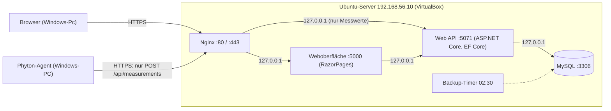

# Architektur

```mermaid
flowchart LR
    Browser["Browser (Windows-Pc)"]
    Agent["Phyton-Agent (Windows-PC)"]
    subgraph Server["Ubuntu-Server 192.168.56.10 (VirtualBox)"]
        Nginx["Nginx :80 / :443"]
        Web["Weboberfläche :5000 (RazorPages)"]
        API["Web API :5071 (ASP.NET Core, EF Core)"]
        DB[("MySQL :3306")]
        Backup["Backup-Timer 02:30"]
    end
    Browser -->|HTTPS| Nginx
    Agent -->|"HTTPS: nur POST /api/measurements"| Nginx
    Nginx -->|127.0.0.1| Web
    Nginx -->|"127.0.0.1 (nur Messwerte)"| API
    Web -->|127.0.0.1| API
    API -->|127.0.0.1| DB
    Backup -.-> DB
```

Nur Nginx ist von außen erreichbar. Weboberfläche, API und Datenbank hören nur auf `127.0.0.1`.